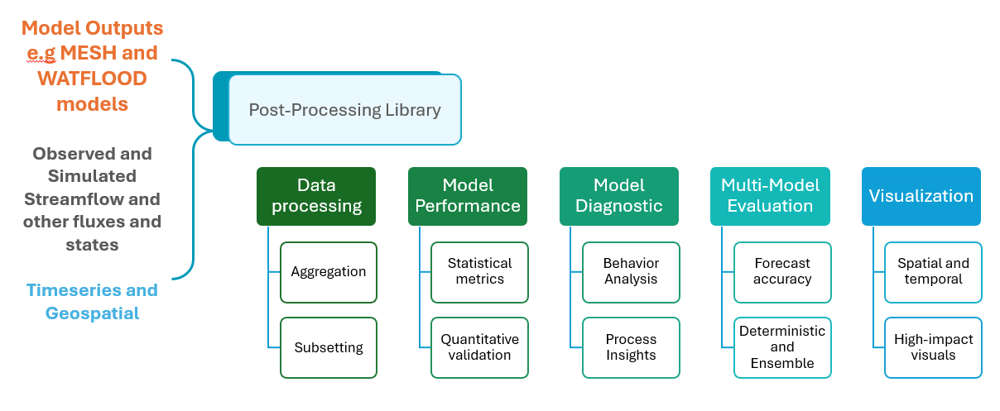
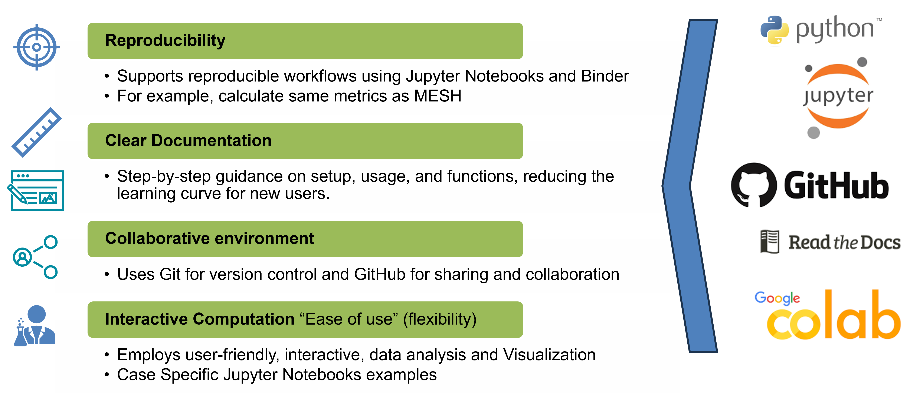

.. NHS_postprocessing documentation master file, created by
   sphinx-quickstart on Thu Jul 18 14:03:07 2024.
   You can adapt this file completely to your liking, but it should at least
   contain the root `toctree` directive.

NHS_postprocessing's documentation!
===================================

The NHS_PostProcessing Library is a library of tools and functions for NHS(National Hydrological Services) users working with time series data.
All of the tools contained in the library are built using a few different python libraries including numpy, scipy, pandas, matplotlib amongst 
others and it was made this way to provode a high level, interface for NHS users to perform all forms of data manipulation, analysis and visualization
tasks.

It contains tools for Preprocessing data, Manipulating and aggregating data, Visualizing data and performing all of sorts of metric calculations on 
measured and predicted time series data. Its is divided into 5 broad sections: 

- Data processing/manipulation
   The sections allows us to take in the raw data/raw model output, process it, aggregate it, and generate the data that is required as inputs to the
   rest of the library.  Its functions are available in the `Data <https://nhs-postprocessing.readthedocs.io/en/stable/Data.html>`_ section. It also has
   a runnable **binder** script located `here <https://mybinder.org/v2/gh/UchechukwuUdenze/NHS_PostProcessing/main?%2FHEAD=&urlpath=%2Fdoc%2Ftree%2Fdocs%2Fsource%2Fnotebooks%2Ftutorial-data-manipulation.ipynb>`_

- Model Perfromance
   The use of statistical metrics to evaluate how well the model is performing in terms of being able to accurately replicate the measured Data.
   Majority of its functions are located in the `Metrics <https://nhs-postprocessing.readthedocs.io/en/stable/Metrics.html>`_ section with tutorials
   available `here <https://github.com/UchechukwuUdenze/NHS_PostProcessing/blob/main/docs/source/notebooks/tutorial-metrics.ipynb>`_ with a 
   runnable **binder** script located `here <https://mybinder.org/v2/gh/UchechukwuUdenze/NHS_PostProcessing/main?%2FHEAD=&urlpath=%2Fdoc%2Ftree%2Fdocs%2Fsource%2Fnotebooks%2Ftutorial-metrics.ipynb>`_ .

- Model Diagonistics
   This section is geared towards estimating certain process based values such as the time to peak (ttp), flow duration curve, amongst many others. Its 
   focus is to evaluate and inform behaviours and trends of the particular model at a particular station. Some of its functions are available in the
   `Data <https://nhs-postprocessing.readthedocs.io/en/stable/Data.html>`_ section and others in the `Metrics <https://nhs-postprocessing.readthedocs.io/en/stable/Metrics.html>`_
   section, with their respective **binder** tutorials `here <https://mybinder.org/v2/gh/UchechukwuUdenze/NHS_PostProcessing/main?%2FHEAD=&urlpath=%2Fdoc%2Ftree%2Fdocs%2Fsource%2Fnotebooks%2Ftutorial-data-manipulation.ipynb>`_
   and `here <https://mybinder.org/v2/gh/UchechukwuUdenze/NHS_PostProcessing/main?%2FHEAD=&urlpath=%2Fdoc%2Ftree%2Fdocs%2Fsource%2Fnotebooks%2Ftutorial-metrics.ipynb>`_ respectfully. 

- Multi-Model Evaluations
   The multimodel evaluations section works to compare the behaviours of different models or different configuration of same model and allow us to assess ensemble performance,
   identify the uncertainty ranges.
   **Insert files here.** 

- Visualizations
   The Visualizations sections allow us to visually study, compare and interprete model output behaviour allowing instantaenous visual identifications of
   differences and discrepancies between measured data and simulated data and between various model data. Its functions are available in the `Visualizations
   <https://nhs-postprocessing.readthedocs.io/en/stable/Visualization.html>`_ sections with a tutorial notebook `here <https://github.com/UchechukwuUdenze/NHS_PostProcessing/blob/main/docs/source/notebooks/tutorial-visualizations.ipynb>`_.
   There is also a runnable **binder** script located `here <https://mybinder.org/v2/gh/UchechukwuUdenze/NHS_PostProcessing/main?%2FHEAD=&urlpath=%2Fdoc%2Ftree%2Fdocs%2Fsource%2Fnotebooks%2Ftutorial-visualizations.ipynb>`_.

Principles of development
--------------------------

It's development is based on the following priciples :

- Reproducibility
   Its methods are made very simple and straightforward using the basic python programs ans functions so that you are able to read through the functions if 
   neccessary and understand whats going on within each module. The library code is available on the `github <https://github.com/UchechukwuUdenze/NHS_PostProcessing/tree/main/postprocessinglib>`_ page.

- Clear Documentation
   The library is built on extensive easy to understand documentation using both read the docs and sphinxs to create the documentation website, jupyter notebook
   to create tutorials that are easy to follow through and binder for those who want to not just follow through but also run the code themselves.

- Project Collaboration
   The project is hosted on Github to allow people to contribute as needed, reques that certain features be added and even fork off it to add features of thier own. 
   The project is also open to collaborations with other projects that may need the tools and functions that are available in the library.

All tutorials are available in the notebooks folder `here <https://github.com/UchechukwuUdenze/NHS_PostProcessing/tree/main/docs/source/notebooks>`_.

.. note:: 
   ***This project is still under Active Development***

.. toctree::
   :maxdepth: 1
   :caption: Contents:
   
   QuickStart
   Preprocessing
   Data
   Metrics
   Visualization
   Analysis
   Contribute

.. toctree::
   :maxdepth: 2
   :caption: Jupyter Notebook Tutorials:

   notebooks/tutorial-data-manipulation
   notebooks/tutorial-visualizations
   notebooks/tutorial-metrics

.. _binder-link:

Interactive Notebooks
---------------------

You can run the notebooks interactively by launching them through Binder. Click the link below to open the notebook in a new tab:

.. raw:: html
   
   <ul>
   <li><a href="https://mybinder.org/v2/gh/UchechukwuUdenze/NHS_PostProcessing/main?%2FHEAD=&urlpath=%2Fdoc%2Ftree%2Fdocs%2Fsource%2Fnotebooks%2Ftutorial-data-manipulation.ipynb" target="_blank">Data Manipulation</a></li>
   <li><a href="https://mybinder.org/v2/gh/UchechukwuUdenze/NHS_PostProcessing/main?%2FHEAD=&urlpath=%2Fdoc%2Ftree%2Fdocs%2Fsource%2Fnotebooks%2Ftutorial-visualizations.ipynb" target="_blank">Visualization</a></li>
   <li><a href="https://mybinder.org/v2/gh/UchechukwuUdenze/NHS_PostProcessing/main?%2FHEAD=&urlpath=%2Fdoc%2Ftree%2Fdocs%2Fsource%2Fnotebooks%2Ftutorial-metrics.ipynb" target="_blank">Metrics</a></li>
   <li><a href="https://mybinder.org/v2/gh/UchechukwuUdenze/NHS_PostProcessing/main?%2FHEAD=&urlpath=%2Fdoc%2Ftree%2Fdocs%2Fsource%2Fnotebooks%2FExamples.ipynb" target="_blank">Examples </a></li>
   </ul>

Indices and tables
==================

* :ref:`genindex`

   
